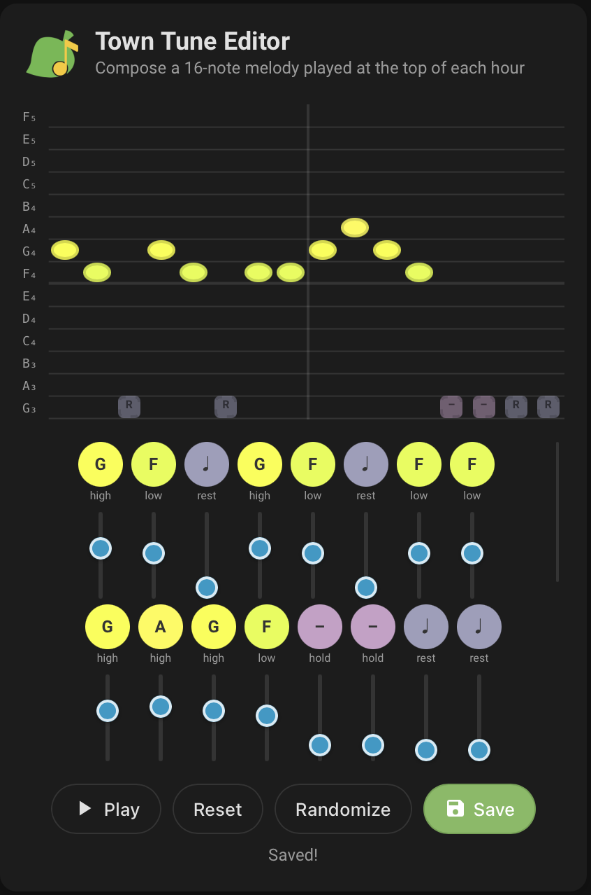

# Animal Crossing Tunes for Home Assistant

[](https://github.com/hacs/integration)
[](https://www.home-assistant.io/)
[](https://github.com/JohnG210/HA-nimal_crossing_tunes/releases)
[](LICENSE)

A Home Assistant custom integration that plays hourly Animal Crossing music on any media player. Inspired by the [AC Music Extension](https://github.com/animal-crossing-music-extension/ac-music-extension).

[](https://my.home-assistant.io/redirect/hacs_repository/?owner=JohnG210&repository=HA-nimal_crossing_tunes&category=integration)

## Features

- **Hourly Music** — Automatically plays the correct hourly track synced to your real clock
- **4 Game Soundtracks** — Animal Crossing, Wild World & City Folk, New Leaf, New Horizons
- **Multi-Game Select** — Pick multiple games and shuffle between them
- **Weather Variants** — Sunny, rainy, and snowy versions; optional live weather from your HA weather entity with mid-song weather switching
- **Song Delay** — Configurable delay (in seconds) between songs
- **Shuffles Per Hour** — Optionally shuffle to a different game's track multiple times per hour
- **K.K. Slider** — Browse and play ~95 K.K. Slider songs (live and aircheck versions); optional Saturday night auto-play
- **Town Tune** — Customizable 16-note town tune chime that plays before hourly music
- **Town Tune Editor Card** — Visual Lovelace card for composing your town tune in the HA UI
- **Duration Tracking** — Tracks song duration for seamless looping and playback control
- **Media Browser** — Full browsable music library in HA's Media Browser
- **Automation Services** — `play_hourly`, `play_kk`, `play_town_tune`, `set_town_tune`, `stop`
- **Auto-Play Switch** — Toggle hourly auto-play on/off from the HA UI
- **AC Clock Card** — Animal Crossing-themed clock with analog/digital modes, dynamic sky, and now-playing info (View Assist compatible)

## Installation

### HACS (Recommended)

1. Open HACS in your Home Assistant instance
2. Click the three dots in the top right → **Custom repositories**
3. Add `https://github.com/JohnG210/HA-nimal_crossing_tunes` and select **Integration** as the category
4. Click **Download** on the Animal Crossing Tunes card
5. Restart Home Assistant

Or click the badge above to add the repository directly.

### Town Tune Editor Card

The town tune editor card is bundled with the integration and served automatically. To use it:

1. Add the resource in **Settings → Dashboards → Resources** (or via YAML):
   ```yaml
   resources:
     - url: /ac_tunes/town-tune-card.js
       type: module
   ```
2. Add a **Manual Card** to your dashboard with this config:
   ```yaml
   type: custom:town-tune-card
   entity: switch.ac_tunes_auto_play
   ```



### Animal Crossing Clock Card

An AC-themed clock card with dynamic sky background, weather icons, and now-playing info. Supports analog and digital modes.

1. Add the resource in **Settings → Dashboards → Resources** (or via YAML):
   ```yaml
   resources:
     - url: /ac_tunes/ac-clock-card.js
       type: module
   ```
2. Add a **Manual Card** to your dashboard:
   ```yaml
   type: custom:ac-clock-card
   entity: switch.ac_tunes_auto_play
   mode: analog          # "analog" or "digital"
   time_format: 12       # 12 or 24
   show_weather: true    # show weather icon
   show_now_playing: true # show game/track info
   ```

#### View Assist Integration

To show the clock automatically on a View Assist / VACA satellite whenever this
integration starts music on its configured speaker:

1. Add a panel view to your **ViewAssist** dashboard (usually at
   `Settings → Dashboards → View Assist`, `url_path: view-assist`):
   ```yaml
   views:
     - title: AC Clock
       path: ac-clock
       panel: true
       cards:
         - type: custom:ac-clock-card
           entity: switch.ac_tunes_auto_play
           mode: analog
   ```
2. In **Settings → Devices & Services → HA-nimal Crossing Tunes → Configure**:
   - Enable **Show Animal Crossing Clock on View Assist display**.
   - Select the paired View Assist sensor, for example `sensor.desk_echo_show`.
   - Set **Animal Crossing Clock view path** to match your dashboard's
     `url_path` plus the view's `path`, e.g. `/view-assist/ac-clock`. This
     defaults to `/view-assist/ac-clock`, but confirm it against your own
     dashboard — a mismatched `url_path` here is a silent no-op: the
     integration will request the navigation and the device state will
     *appear* to move (the request is echoed back), but nothing renders on
     screen because the page doesn't exist. As of the navigation-verification
     fix, a mismatch instead logs a warning naming the requested path and
     what the satellite actually reports.

The integration intentionally requires this explicit pairing. If View Assist is
not installed, the selected entity is not a VACA display, the option is off, or
music is sent to another player, playback continues normally and no screen is
changed. Navigation happens *after* the music starts, because VACA may first
switch itself to its music page during media playback.

The bundled **View Assist - Show Animal Crossing Clock** blueprint remains
available when you also want to open the clock by voice command.

### Manual

1. Copy the `custom_components/ac_tunes` folder into your Home Assistant `config/custom_components/` directory
2. Restart Home Assistant

## Setup

1. Go to **Settings → Devices & Services → Add Integration**
2. Search for **Animal Crossing Tunes**
3. Configure:
   - **Games** — Select one or more soundtracks (multi-select)
   - **Weather Mode** — Always Sunny, Rainy, Snowy, Live Weather, or Random
   - **Media Player** — Select which media player to use for auto-play
   - **Audio Source** — Remote streaming (default) or local files
   - **Song Delay** — Seconds of silence between songs (default 0)
   - **Shuffles Per Hour** — How many times to shuffle to a different game per hour (0 = disabled)
   - **K.K. Slider** — Never, Saturday nights, or always
   - **K.K. Version** — Live or aircheck recordings

## Services

All playback services take a standard Home Assistant **target**, so you can
point them at an entity, a device or a whole area:

```yaml
action: ac_tunes.play_hourly
target:
  entity_id: media_player.living_room
data:
  game: new-horizons
```

Passing `entity_id` under `data:` still works for existing automations.

### `ac_tunes.play_hourly`

Play the current hour's track on a media player.

| Parameter | Required | Description |
|-----------|----------|-------------|
| target | Yes | Media player entity, device or area |
| `game` | No | Game override (uses config default) |
| `weather` | No | Weather override (uses config default) |

### `ac_tunes.play_kk`

Play a K.K. Slider song.

| Parameter | Required | Description |
|-----------|----------|-------------|
| target | Yes | Media player entity, device or area |
| `song_name` | Yes | K.K. Slider song name |
| `version` | No | `live` (default) or `aircheck` |

### `ac_tunes.play_town_tune`

Play the town tune chime, then start the current hour's track. On players
that support announcements the chime is played over the music and the
player resumes on its own.

| Parameter | Required | Description |
|-----------|----------|-------------|
| target | Yes | Media player entity, device or area |
| `game` | No | Game override (uses config default) |
| `weather` | No | Weather override (uses config default) |

### `ac_tunes.set_town_tune`

Save a new 16-note town tune and regenerate the audio file.

| Parameter | Required | Description |
|-----------|----------|-------------|
| `notes` | Yes | List of 16 note characters: `g`–`f` (lower), `G`–`F` (upper), `z` (rest), `-` (sustain) |

### `ac_tunes.stop`

Stop playback on a media player.

| Parameter | Required | Description |
|-----------|----------|-------------|
| target | Yes | Media player entity, device or area |

## Media Browser

Open the **Media Browser** in Home Assistant to browse:

```
Animal Crossing Tunes/
├── Hourly Music/
│   ├── Animal Crossing/ → Sunny, Snowy
│   ├── Wild World & City Folk/ → Sunny, Rainy, Snowy
│   ├── New Leaf/ → Sunny, Rainy, Snowy
│   └── New Horizons/ → Sunny, Rainy, Snowy
└── K.K. Slider/
    ├── Live/ → ~95 songs
    └── Aircheck/ → ~95 songs
```

## Local Files

To use local audio files instead of remote streaming:

1. Create a directory structure under your HA media folder:
   ```
   /media/ac_tunes/
   ├── animal-crossing/sunny/12am.ogg, 1am.ogg, ...
   ├── wild-world/sunny/12am.ogg, ...
   ├── new-leaf/rainy/12am.ogg, ...
   ├── new-horizons/snowing/12am.ogg, ...
   └── kk/live/K.K. Waltz.ogg, ...
   ```
2. Set **Audio Source** to **Local Files** and enter your path in the config

## Audio Source

By default, music streams from `acmusicext.com` (the same source as the original browser extension). Audio files are in OGG format.

## Credits

- Music and characters are property of Nintendo
- Audio hosted by [acmusicext.com](https://acmusicext.com/)
- Inspired by the [Animal Crossing Music Extension](https://github.com/animal-crossing-music-extension/ac-music-extension)
